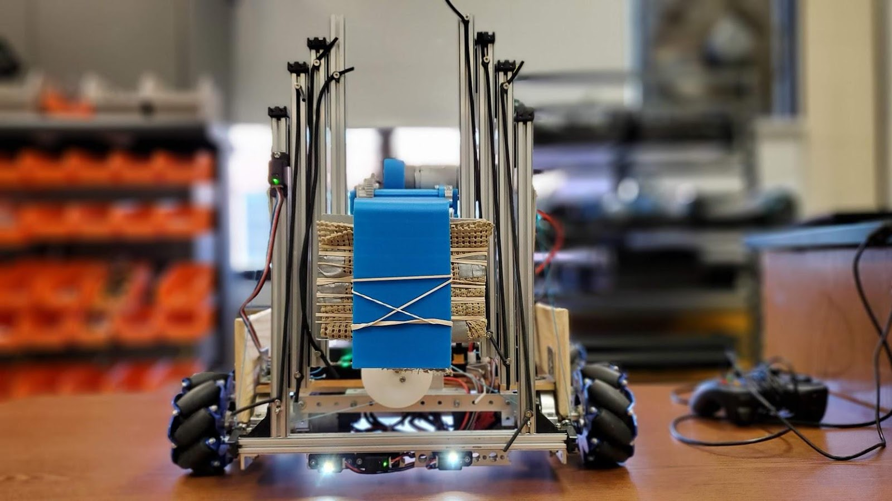

# VegaSkystone2019-20
Team 7407 Vega's app for the 2019-20 FTC Game "Skystone."

## Installation
This code was written in Android Studio, the two ways to import this project are:
1. Download the zip file by clicking "Code" and then "Download Zip" on Github.
2. Clone the following link through Git: https://github.com/ThatKidTiger/Vega2019-2020-ftc_app.git

# Features

## Navigation / Localization
The primary methods of navigation for this years robot were the IMU rotation sensor on board the Rev hub, combined with two distance sensors, one mounted high up on the robot, and one mounted close to the ground.

The top-mounted distance sensor serves to measure the distance of the robot from the wall it is facing.
The bottom mounted distance sensor serves to measure the distance from the robot to the block it is facing.

## Stone Identification
In addition, the front of the robot has two attached color sensors, spaced approximately one stone's width apart. This allows a strafing robot to detect when it is centered on a stone (when both color sensors register yellow).
